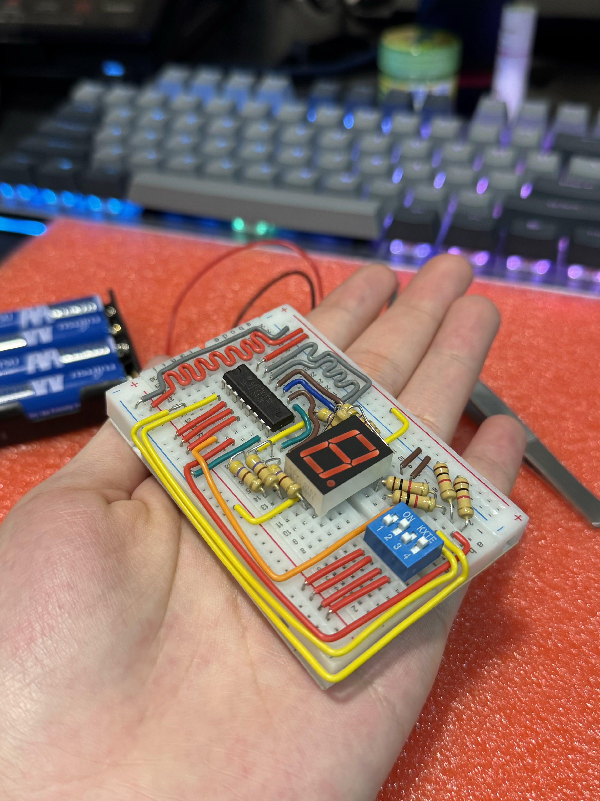
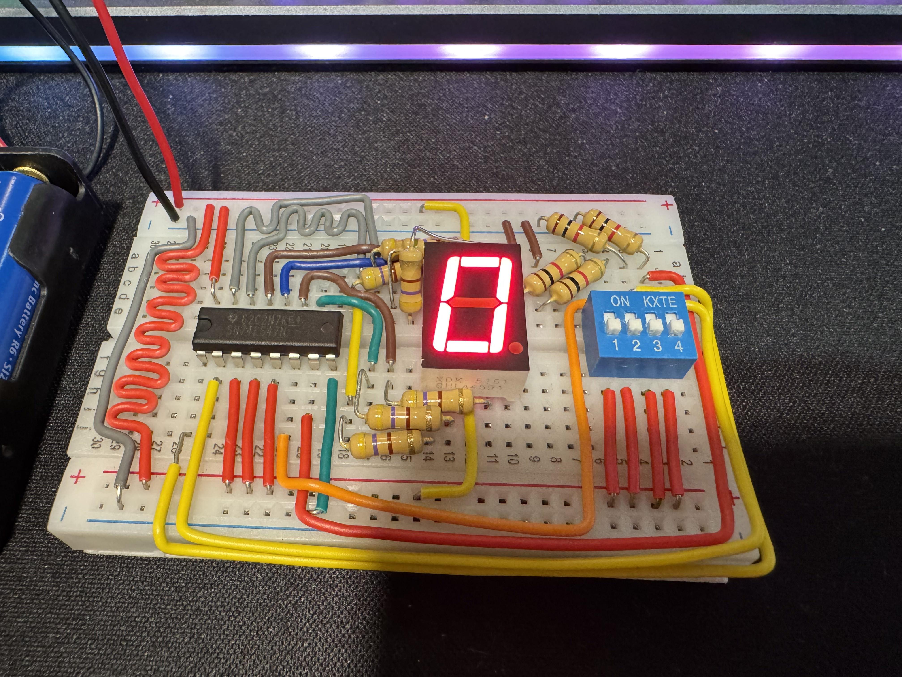
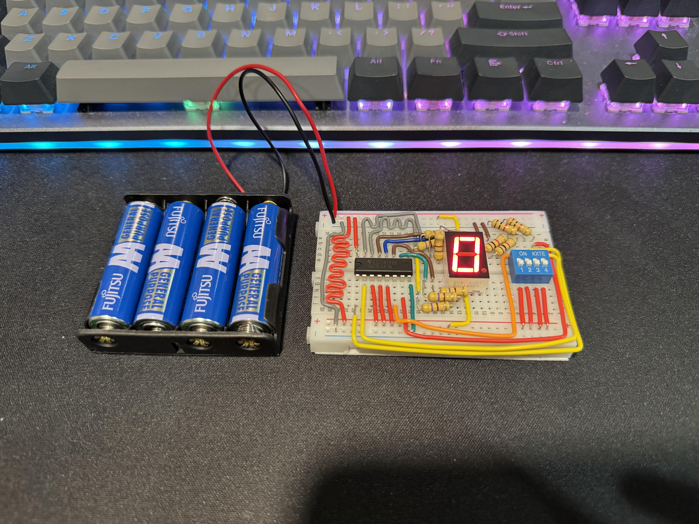
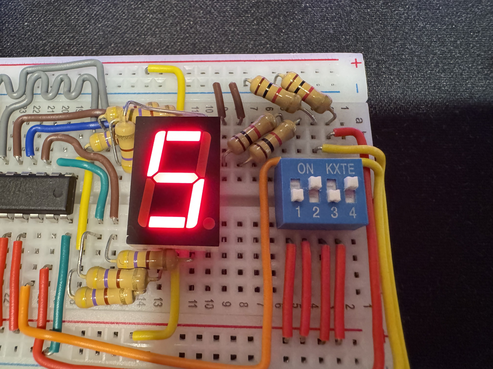
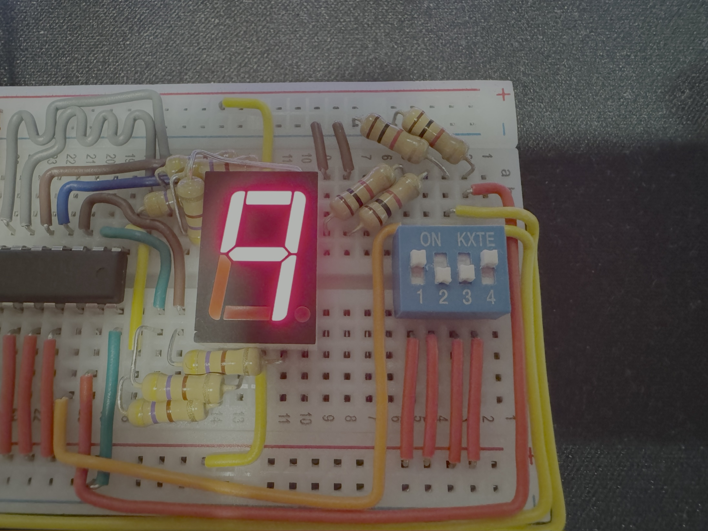

# Binary Decoder - 7 Segment Display

[![Electronics](https://img.shields.io/badge/Electronics-B03931?style=flat&logo=data:image/svg+xml;base64,PCFET0NUWVBFIHN2ZyBQVUJMSUMgIi0vL1czQy8vRFREIFNWRyAxLjEvL0VOIiAiaHR0cDovL3d3dy53My5vcmcvR3JhcGhpY3MvU1ZHLzEuMS9EVEQvc3ZnMTEuZHRkIj4KDTwhLS0gVXBsb2FkZWQgdG86IFNWRyBSZXBvLCB3d3cuc3ZncmVwby5jb20sIFRyYW5zZm9ybWVkIGJ5OiBTVkcgUmVwbyBNaXhlciBUb29scyAtLT4KPHN2ZyB3aWR0aD0iODAwcHgiIGhlaWdodD0iODAwcHgiIHZpZXdCb3g9IjAgMCAyNCAyNCIgaWQ9IkxheWVyXzEiIGRhdGEtbmFtZT0iTGF5ZXIgMSIgeG1sbnM9Imh0dHA6Ly93d3cudzMub3JnLzIwMDAvc3ZnIiBmaWxsPSIjMDAwMEZGRkZGRiIgc3Ryb2tlPSIjMDAwMEZGRkZGRiI+Cg08ZyBpZD0iU1ZHUmVwb19iZ0NhcnJpZXIiIHN0cm9rZS13aWR0aD0iMCIvPgoNPGcgaWQ9IlNWR1JlcG9fdHJhY2VyQ2FycmllciIgc3Ryb2tlLWxpbmVjYXA9InJvdW5kIiBzdHJva2UtbGluZWpvaW49InJvdW5kIi8+Cg08ZyBpZD0iU1ZHUmVwb19pY29uQ2FycmllciI+Cg08ZGVmcz4KDTxzdHlsZT4uY2xzLTF7ZmlsbDpub25lO3N0cm9rZTojZmZmZmZmO3N0cm9rZS1taXRlcmxpbWl0OjEwO3N0cm9rZS13aWR0aDoxLjkycHg7fS5jbHMtMntmaWxsOiNmZmZmZmY7fTwvc3R5bGU+Cg08L2RlZnM+Cg08cmVjdCBjbGFzcz0iY2xzLTEiIHg9IjUuMjkiIHk9IjUuMjkiIHdpZHRoPSIxMy40MiIgaGVpZ2h0PSIxMy40MiIgcng9IjIuMjQiLz4KDTxsaW5lIGNsYXNzPSJjbHMtMSIgeDE9IjcuMjEiIHkxPSIwLjUiIHgyPSI3LjIxIiB5Mj0iNS4yOSIvPgoNPGxpbmUgY2xhc3M9ImNscy0xIiB4MT0iMTIiIHkxPSIwLjUiIHgyPSIxMiIgeTI9IjUuMjkiLz4KDTxsaW5lIGNsYXNzPSJjbHMtMSIgeDE9IjE2Ljc5IiB5MT0iMC41IiB4Mj0iMTYuNzkiIHkyPSI1LjI5Ii8+Cg08bGluZSBjbGFzcz0iY2xzLTEiIHgxPSI3LjIxIiB5MT0iMTguNzEiIHgyPSI3LjIxIiB5Mj0iMjMuNSIvPgoNPGxpbmUgY2xhc3M9ImNscy0xIiB4MT0iMTIiIHkxPSIxOC43MSIgeDI9IjEyIiB5Mj0iMjMuNSIvPgoNPGxpbmUgY2xhc3M9ImNscy0xIiB4MT0iMTYuNzkiIHkxPSIxOC43MSIgeDI9IjE2Ljc5IiB5Mj0iMjMuNSIvPgoNPGxpbmUgY2xhc3M9ImNscy0xIiB4MT0iMC41IiB5MT0iMTYuNzkiIHgyPSI1LjI5IiB5Mj0iMTYuNzkiLz4KDTxsaW5lIGNsYXNzPSJjbHMtMSIgeDE9IjAuNSIgeTE9IjEyIiB4Mj0iNS4yOSIgeTI9IjEyIi8+Cg08bGluZSBjbGFzcz0iY2xzLTEiIHgxPSIwLjUiIHkxPSI3LjIxIiB4Mj0iNS4yOSIgeTI9IjcuMjEiLz4KDTxsaW5lIGNsYXNzPSJjbHMtMSIgeDE9IjE4LjcxIiB5MT0iMTYuNzkiIHgyPSIyMy41IiB5Mj0iMTYuNzkiLz4KDTxsaW5lIGNsYXNzPSJjbHMtMSIgeDE9IjE4LjcxIiB5MT0iMTIiIHgyPSIyMy41IiB5Mj0iMTIiLz4KDTxsaW5lIGNsYXNzPSJjbHMtMSIgeDE9IjE4LjcxIiB5MT0iNy4yMSIgeDI9IjIzLjUiIHkyPSI3LjIxIi8+Cg08Y2lyY2xlIGNsYXNzPSJjbHMtMiIgY3g9IjE1LjgzIiBjeT0iOC4xNyIgcj0iMC45NiIvPgoNPC9nPgoNPC9zdmc+&logoColor=white)]()

A device that translates binary inputs into decimal outputs. A binary input is fed into the device using the 4 bit DIP switch and goes through the 7447 BCD decoder. The decimal output is then shown on the 7 segment display. This device is powered by a 6V power supply.

## Photos

